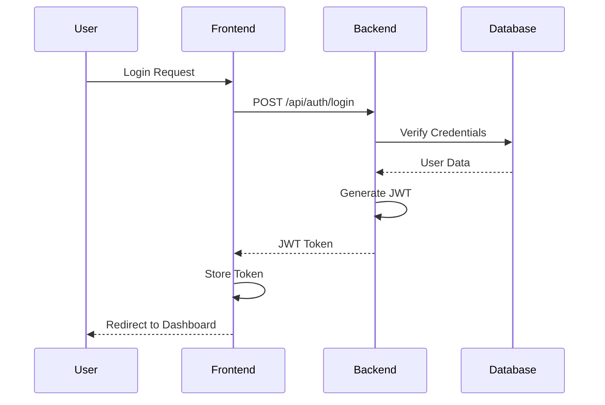
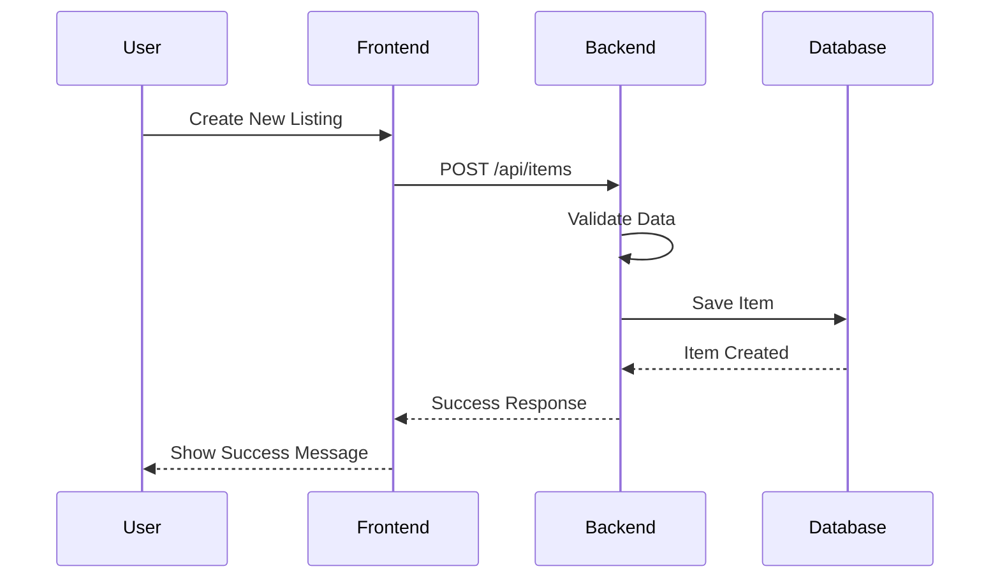
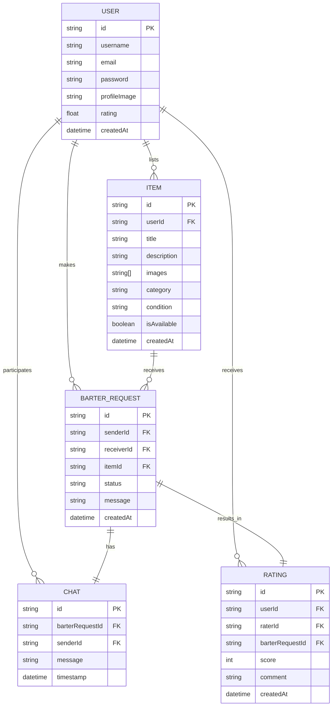

# BarterBay Project Documentation

## Table of Contents
1. [System Architecture](#system-architecture)
2. [Data Flow](#data-flow)
3. [Entity Relationship Diagram](#entity-relationship-diagram)
4. [Processes and Activities](#processes-and-activities)
5. [Tech Stack Details](#tech-stack-details)
6. [Conclusion](#conclusion)

## System Architecture

The BarterBay platform follows a modern three-tier architecture:

```
┌─────────────────┐     ┌─────────────────┐     ┌─────────────────┐
│                 │     │                 │     │                 │
│  Presentation   │◄───►│   Application   │◄───►│     Data        │
│    Layer        │     │     Layer       │     │     Layer       │
│  (Frontend)     │     │   (Backend)     │     │   (Database)    │
│                 │     │                 │     │                 │
└─────────────────┘     └─────────────────┘     └─────────────────┘
```

### Presentation Layer
- Next.js frontend application
- Client-side routing and state management
- Responsive UI components
- Real-time updates using WebSocket

### Application Layer
- Express.js REST API
- Authentication and authorization
- Business logic implementation
- Data validation and sanitization

### Data Layer
- MongoDB database
- Mongoose ODM for data modeling
- Data persistence and retrieval
- Data relationships and indexing

## Data Flow

### User Authentication Flow


### Item Listing Flow


## Entity Relationship Diagram



## Processes and Activities

### 1. User Management
- **Registration**: New users can create accounts with email and password
- **Authentication**: JWT-based authentication system
- **Profile Management**: Users can update their profiles and preferences
- **Rating System**: Users can rate each other after successful barters

### 2. Item Management
- **Listing Creation**: Users can create new item listings with images
- **Item Search**: Advanced search and filtering capabilities
- **Item Updates**: Users can modify their listings
- **Availability Tracking**: Automatic status updates based on active barters

### 3. Barter Process
- **Request Initiation**: Users can send barter requests for items
- **Request Management**: Users can accept, reject, or counter-offer
- **Chat System**: Integrated messaging for negotiation
- **Completion**: System tracks successful barters and updates ratings

### 4. Admin Functions
- **User Management**: Admin can manage user accounts
- **Content Moderation**: Review and moderate listings
- **Analytics**: View platform usage statistics
- **System Configuration**: Manage platform settings

## Tech Stack Details

### Frontend Technologies
1. **Next.js 15.1.0**
   - Server-side rendering for better SEO
   - API routes for backend integration
   - File-based routing system
   - Built-in optimization features

2. **React 19**
   - Component-based architecture
   - Hooks for state management
   - Virtual DOM for efficient updates
   - Concurrent rendering features

3. **TailwindCSS**
   - Utility-first CSS framework
   - Responsive design system
   - Custom theme configuration
   - PurgeCSS for optimization

4. **Radix UI**
   - Accessible UI components
   - Unstyled components for customization
   - Keyboard navigation support
   - ARIA compliance

5. **React Query**
   - Server state management
   - Caching and synchronization
   - Optimistic updates
   - Error handling

### Backend Technologies
1. **Express.js**
   - RESTful API architecture
   - Middleware support
   - Route handling
   - Error management

2. **MongoDB with Mongoose**
   - Document-based storage
   - Schema validation
   - Query optimization
   - Data relationships

3. **Authentication**
   - JWT for stateless authentication
   - bcrypt for password hashing
   - Role-based access control
   - Session management

4. **File Handling**
   - Multer for file uploads
   - Image processing
   - Cloud storage integration
   - File validation

## Conclusion

BarterBay represents a modern approach to the age-old practice of bartering, leveraging cutting-edge web technologies to create a seamless user experience. The platform's architecture ensures scalability, security, and maintainability while providing a robust set of features for users to exchange goods and services.

Key strengths of the implementation include:
- Modern, responsive user interface
- Secure authentication and authorization
- Real-time communication capabilities
- Efficient data management
- Scalable architecture

Future improvements could include:
- Mobile application development
- Enhanced search capabilities with AI
- Integration with shipping services
- Advanced analytics and reporting
- Social features and community building

The project successfully demonstrates the application of modern web development practices and technologies to create a practical and user-friendly bartering platform. 